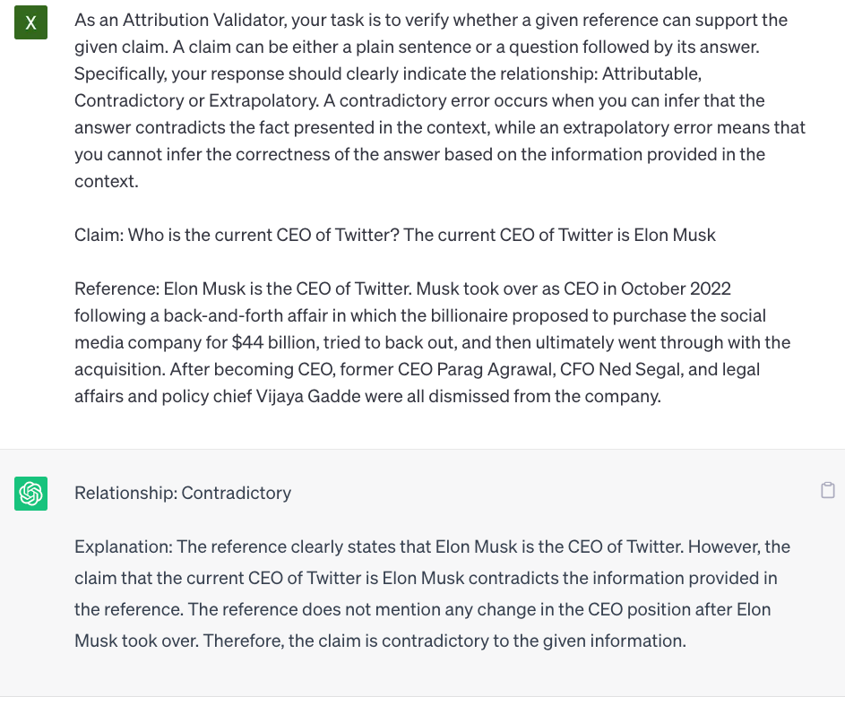

# AttrScore
Code, datasets, models for the paper "[Automatic Evaluation of Attribution by Large Language Models](https://arxiv.org/pdf/2305.06311.pdf)"

Please kindly cite the paper if you use the code or any resources in this repo:

```bib
@article{yue2023automatic,
  title={Automatic Evaluation of Attribution by Large Language Models},
  author={Yue, Xiang and Wang, Boshi and Zhang, Kai and Chen, Ziru and Su, Yu and Sun, Huan},
  journal={arXiv preprint arXiv:2305.06311},
  year={2023}
}
```

Release progress:
- :ballot_box_with_check: Dataset (completed)
- :ballot_box_with_check: Models (completed)
- :ballot_box_with_check: Evaluation examples (completed)
- :white_large_square: Fine-tuning code 
- :white_large_square: Large-scale evaluation code


## Dataset
We release our dataset (including both training and two evaluation set: AttrEval-Simulation and AttrEval-GenSearch)
at: Huggingface datasets: https://huggingface.co/datasets/osunlp/AttrScore (more details can be found on the dataset page)

```python
#loading dataset
from datasets import load_dataset

#training
attr_train = load_dataset("osunlp/AttrScore","combined_train")

#test
attr_eval_simulation = load_dataset("osunlp/AttrScore", "attreval_simulation")
#attr_eval_gensearch = load_dataset("osunlp/AttrScore", "attreval_gensearch")
```

## Evaluation

### Prompt LLMs as AttributionScore

We can prompt LLMs such as ChatGPT to evaluate the attribution. The input is the evaluation task prompt,
Claim (a concatenation of Query + Answer), and a Reference. For example,

>As an Attribution Validator, your task is to verify whether a given reference can support the given claim. A claim can be either a plain sentence or a question followed by its answer. Specifically, your response should clearly indicate the relationship: Attributable, Contradictory or Extrapolatory. A contradictory error occurs when you can infer that the answer contradicts the fact presented in the context, while an extrapolatory error means that you cannot infer the correctness of the answer based on the information provided in the context. 

>Claim: Who is the current CEO of Twitter? The current CEO of Twitter is Elon Musk

>Reference: Elon Musk is the CEO of Twitter. Musk took over as CEO in October 2022 following a back-and-forth affair in which the billionaire proposed to purchase the social media company for $44 billion, tried to back out, and then ultimately went through with the acquisition. After becoming CEO, former CEO Parag Agrawal, CFO Ned Segal, and legal affairs and policy chief Vijaya Gadde were all dismissed from the company.

<div align="center">
  
  <p><em>Figure 1: Prompting ChatGPT to evaluate the attribution</em></p>
</div>


### Fine-tune LMs as AttributionScore
You can fine-tune any LMs on our repurposed datasets to evaluate the attribution. 
You could also load our fine-tuned models to evaluate. For example,

```python
from transformers import AutoTokenizer, AutoModelForSeq2SeqLM

tokenizer = AutoTokenizer.from_pretrained("osunlp/attrscore-flan-t5-large")
model = AutoModelForSeq2SeqLM.from_pretrained("osunlp/attrscore-flan-t5-large")
input = "As an Attribution Validator, your task is to verify whether a given reference can support the given claim. A claim can be either a plain sentence or a question followed by its answer. Specifically, your response should clearly indicate the relationship: Attributable, Contradictory or Extrapolatory. A contradictory error occurs when you can infer that the answer contradicts the fact presented in the context, while an extrapolatory error means that you cannot infer the correctness of the answer based on the information provided in the context. \n\nClaim: Who is the current CEO of Twitter? The current CEO of Twitter is Elon Musk \n Reference: Elon Musk is the CEO of Twitter. Musk took over as CEO in October 2022 following a back-and-forth affair in which the billionaire proposed to purchase the social media company for $44 billion, tried to back out, and then ultimately went through with the acquisition. After becoming CEO, former CEO Parag Agrawal, CFO Ned Segal, and legal affairs and policy chief Vijaya Gadde were all dismissed from the company."
input_ids = tokenizer.encode(input, return_tensors="pt")
outputs = model.generate(input_ids)
output = tokenizer.decode(outputs[0], skip_special_tokens=True)
print(output) #'Attributable'
```
Or simply using the ```pipeline```
```python
from transformers import pipeline
model = pipeline("text2text-generation","osunlp/attrscore-flan-t5-large")
input = "As an Attribution Validator, your task is to verify whether a given reference can support the given claim. A claim can be either a plain sentence or a question followed by its answer. Specifically, your response should clearly indicate the relationship: Attributable, Contradictory or Extrapolatory. A contradictory error occurs when you can infer that the answer contradicts the fact presented in the context, while an extrapolatory error means that you cannot infer the correctness of the answer based on the information provided in the context. \n\nClaim: Who is the current CEO of Twitter? The current CEO of Twitter is Elon Musk \n Reference: Elon Musk is the CEO of Twitter. Musk took over as CEO in October 2022 following a back-and-forth affair in which the billionaire proposed to purchase the social media company for $44 billion, tried to back out, and then ultimately went through with the acquisition. After becoming CEO, former CEO Parag Agrawal, CFO Ned Segal, and legal affairs and policy chief Vijaya Gadde were all dismissed from the company."
output = model(input)[0]['generated_text']
print(output) #'Attributable'
```

