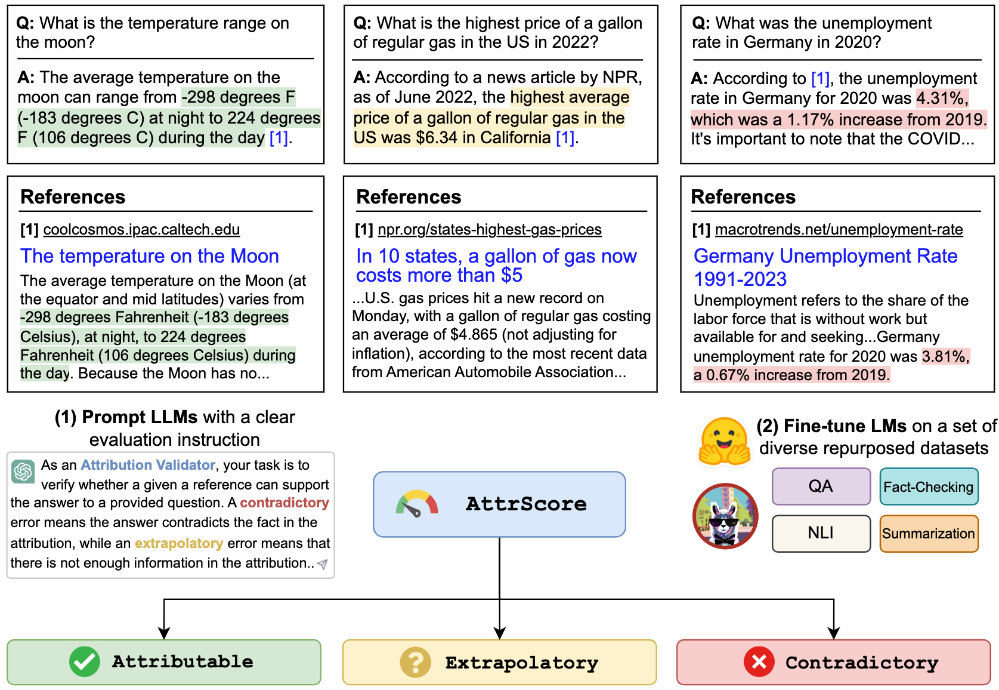

# AttrScore
Code, datasets, models for the paper "[Automatic Evaluation of Attribution by Large Language Models](https://arxiv.org/pdf/2305.06311.pdf)"



## What's New?
**June 26, 2023**: 1) Evaluation results of more models including GPT-4. 2) Thorough re-examination of the AttrEval-GenSearch dataset and correcting some annotation issues. Updated dataset released.
3) Training and evaluation code as well as model checkpoints released.


## Dataset

We release our dataset (including training and two evaluation sets: AttrEval-Simulation and AttrEval-GenSearch)
at: [Huggingface datasets](https://huggingface.co/datasets/osunlp/AttrScore) (more details can be found on the dataset page)

```python
#loading dataset
from datasets import load_dataset

# training
attr_train = load_dataset("osunlp/AttrScore","combined_train")

# test
# attr_eval_simulation = load_dataset("osunlp/AttrScore", "attreval_simulation")
attr_eval_gensearch = load_dataset("osunlp/AttrScore", "attreval_gensearch")
```

## Evaluation
We show our results for both prompting LLMs and fine-tuning LLMs on repurposed data from related tasks.

|     |                                                                           |  |      |  | Simulation |  |  |  | GenSearch |
|------------|---------------------------------------------------------------------------|-------|---------|-------|------------|-------|-----------|--------|---------|
| Setting    | Model (Size)                                                              | Attr. | Contra. | Extra. | Overall    | Attr. | Contra.   | Extra. | Overall |
| Zero-shot  | Alpaca (7B)                                                               | 50.0  | 4.0     | 1.4   | 33.6       | 50.7  | 8.6       | 3.6    | 34.3    |
|            | Alpaca (13B)                                                              | 48.3  | 5.6     | 2.2   | 33.5       | 50.6  | 6.1       | 19.3   | 34.7    |
|            | Vicuna (13B)                                                              | 46.3  | 8.3     | 21.6  | 34.6       | 54.4  | 13.3      | 26.1   | 41.4    |
|            | ChatGPT                                                                   | 45.7  | 17.9    | 52.7  | 43.2       | 61.2  | 20.6      | 53.3   | 55.0    |
|            | GPT-4                                                                     | **58.7** | **23.2** | **61.5** | **55.6**   | **87.3** | **45.0**  | **89.6** | **85.1** |
| Few-shot   | Alpaca (7B)                                                               | 45.4  | 8.2     | 9.6   | 31.9       | 49.6  | 5.2       | 13.5   | 37.2    |
|            | Alpaca (13B)                                                              | 38.9  | 20.1    | 2.2   | 33.1       | 50.5  | 10.3      | 5.6    | 34.8    |
|            | Vicuna (13B)                                                              | 35.4  | **37.2** | 0.3   | 32.6       | 50.6  | 9.1       | 8.4    | 34.1    |
|            | ChatGPT                                                                   | 46.6  | 27.6    | 35.8  | 39.2       | 62.6  | 26.8      | 49.5   | 53.3    |
|            | GPT-4                                                                     | **61.1** | 31.3    | **68.8** | **60.0**   | **85.2** | **53.3**  | **88.9** | **84.3** |
| Fine-tuned | Roberta (330M)                                                            | 62.5  | 54.6    | 74.7  | 65.0       | 47.2  | 25.2      | 62.3   | 49.8    |
|            | GPT2 (1.5B)                                                               | 63.6  | 54.6    | 71.9  | 63.5       | 51.1  | 18.6      | 60.7   | 47.4    |
|            | T5 (770M)                                                                 | 45.9  | **57.1** | 71.6  | 59.1       | 58.5  | 24.3      | 72.5   | 61.6    |
|            | [Flan-T5 (770M)]((https://huggingface.co/osunlp/attrscore-flan-t5-large)) | 57.3  | 50.1    | 70.5  | 59.3       | 64.3  | 27.6      | 72.9   | 64.5    |
|            | [Flan-T5 (3B)](https://huggingface.co/osunlp/attrscore-flan-t5-xl)        | 48.1  | 48.7    | 67.1  | 55.7       | 77.7  | **44.4**  | **80.0**  | **75.2** |
|            | [Flan-T5 (11B)](https://huggingface.co/osunlp/attrscore-flan-t5-xxl)      | 48.4  | 49.9    | 66.5  | 55.4       | **81.6** | 38.9      | 76.9   | 72.7    |
|            | [LLaMA (7B)](https://huggingface.co/osunlp/attrscore-llama-7b)                                                             | 62.2  | 50.7    | 74.6  | 62.8       | 77.9  | 41.1      | 78.3   | 72.5    |
|            | [Alpaca (7B)](https://huggingface.co/osunlp/attrscore-alpaca-7b)          | **66.8** | 41.1    | 76.8  | 64.5       | 73.0  | 30.2      | **80.0**  | 72.5    |
|            | [Alpaca (13B)](https://huggingface.co/osunlp/attrscore-alpaca-13b)        | 63.6  | 48.9    | 75.8  | 63.6       | 77.5  | 34.5      | 79.4   | 73.3    |
|            | [Vicuna (13B)](https://huggingface.co/osunlp/attrscore-vicuna-13b)        | 66.2  | 49.1    | **78.6** | **66.0**   | 69.4  | 37.7      | 79.9   | 72.1    |


### Prompt LLMs (zero/few-shot)

We can prompt LLMs such as ChatGPT and GPT-4 to evaluate the attribution. The input is the evaluation task prompt,
Claim (a concatenation of **Query + Answer**), and a Reference. For example,

>Verify whether a given reference can support the claim. Options: Attributable, Extrapolatory or Contradictory. Attributable means the reference fully supports the claim, Extrapolatory means the reference lacks sufficient information to validate the claim, and Contradictory means the claim contradicts the information presented in the reference. 

>Claim: Who is the current CEO of Twitter? The current CEO of Twitter is Elon Musk

>Reference: Elon Musk is the CEO of Twitter. Musk took over as CEO in October 2022 following a back-and-forth affair in which the billionaire proposed to purchase the social media company for $44 billion, tried to back out, and then ultimately went through with the acquisition. After becoming CEO, former CEO Parag Agrawal, CFO Ned Segal, and legal affairs and policy chief Vijaya Gadde were all dismissed from the company.


To replicate the number in the table for **ChatGPT/GPT4**, please copy your OpenAI API Key in ```"./api_key.txt"``` and then
run the notebook example ```prompt_chatgpt_gpt4.ipynb```

To prompt LLaMA/Alpaca/Vicuna, please see below for how to run inference on these models.


### Fine-tune LMs
You can fine-tune any LMs on our repurposed datasets to evaluate the attribution.

Here, we give an example for fine-tuning LLaMA/Alpaca/Vicuna. You can use the ```--model_name_or_path``` with any LLaMA family models.
We do full fine-tuning of LLaMA/Alpaca/Vicuna 7B/13B models with 4 A100 80GB GPUs.


```bash
torchrun --nproc_per_node 4 train_alpaca.py \
  --model_name_or_path chavinlo/alpaca-13b \
  --data_path osunlp/AttrScore \
  --train_subset 'combined_train' \
  --input_has_query True \
  --num_train_samples -1 \
  --bf16 True \
  --output_dir tmp/alpaca_13b_combined_train/ \
  --evaluation_strategy steps \
  --eval_steps 500 \
  --num_train_epochs 1 \
  --model_max_length 512 \
  --per_device_train_batch_size 2 \
  --per_device_eval_batch_size 2 \
  --gradient_accumulation_steps 8 \
  --save_strategy steps \
  --save_steps 5000 \
  --save_total_limit 1 \
  --learning_rate 2e-5 \
  --weight_decay 0. \
  --warmup_ratio 0.03 \
  --lr_scheduler_type cosine \
  --logging_steps 1 \
  --fsdp 'full_shard auto_wrap' \
  --fsdp_transformer_layer_cls_to_wrap 'LlamaDecoderLayer' \
  --tf32 True

```


You could also load our fine-tuned models to evaluate. We provide the following checkpoints we trained on the ```combined_train``` dataset in Huggingface Models:

- FLAN-T5-Large (770M): [osunlp/attrscore-flan-t5-large](https://huggingface.co/osunlp/attrscore-flan-t5-large)
- FLAN-T5-XL (3B): [osunlp/attrscore-flan-t5-xl](https://huggingface.co/osunlp/attrscore-flan-t5-xl)
- FLAN-T5-XXL (11B): [osunlp/attrscore-flan-t5-xxl](https://huggingface.co/osunlp/attrscore-flan-t5-xxl)
- LLaMA (7B) [osunlp/attrscore-llama-7b](https://huggingface.co/osunlp/attrscore-llama-7b)
- Alpaca (7B) [osunlp/attrscore-alpaca-7b](https://huggingface.co/osunlp/attrscore-alpaca-7b)
- Alpaca (13B) [osunlp/attrscore-alpaca-13b](https://huggingface.co/osunlp/attrscore-alpaca-13b)
- Vicuna (13B) [osunlp/attrscore-vicuna-13b](https://huggingface.co/osunlp/attrscore-vicuna-13b)

For example,

```python
from transformers import AutoTokenizer, AutoModelForSeq2SeqLM

tokenizer = AutoTokenizer.from_pretrained("osunlp/attrscore-flan-t5-xl")
model = AutoModelForSeq2SeqLM.from_pretrained("osunlp/attrscore-flan-t5-xl")
input = "As an Attribution Validator, your task is to verify whether a given reference can support the given claim. A claim can be either a plain sentence or a question followed by its answer. Specifically, your response should clearly indicate the relationship: Attributable, Contradictory or Extrapolatory. A contradictory error occurs when you can infer that the answer contradicts the fact presented in the context, while an extrapolatory error means that you cannot infer the correctness of the answer based on the information provided in the context. \n\nClaim: Who is the current CEO of Twitter? The current CEO of Twitter is Elon Musk \n Reference: Elon Musk is the CEO of Twitter. Musk took over as CEO in October 2022 following a back-and-forth affair in which the billionaire proposed to purchase the social media company for $44 billion, tried to back out, and then ultimately went through with the acquisition. After becoming CEO, former CEO Parag Agrawal, CFO Ned Segal, and legal affairs and policy chief Vijaya Gadde were all dismissed from the company."
input_ids = tokenizer.encode(input, return_tensors="pt")
outputs = model.generate(input_ids)
output = tokenizer.decode(outputs[0], skip_special_tokens=True)
print(output) #'Attributable'
```

Or simply using the ```pipeline```
```python
from transformers import pipeline
model = pipeline("text2text-generation","osunlp/attrscore-flan-t5-xl")
input = "As an Attribution Validator, your task is to verify whether a given reference can support the given claim. A claim can be either a plain sentence or a question followed by its answer. Specifically, your response should clearly indicate the relationship: Attributable, Contradictory or Extrapolatory. A contradictory error occurs when you can infer that the answer contradicts the fact presented in the context, while an extrapolatory error means that you cannot infer the correctness of the answer based on the information provided in the context. \n\nClaim: Who is the current CEO of Twitter? The current CEO of Twitter is Elon Musk \n Reference: Elon Musk is the CEO of Twitter. Musk took over as CEO in October 2022 following a back-and-forth affair in which the billionaire proposed to purchase the social media company for $44 billion, tried to back out, and then ultimately went through with the acquisition. After becoming CEO, former CEO Parag Agrawal, CFO Ned Segal, and legal affairs and policy chief Vijaya Gadde were all dismissed from the company."
output = model(input)[0]['generated_text']
print(output) #'Attributable'
```

We show an inference and evaluation script for LLaMA-based models:
```bash
python inference_alpaca.py \
--model_name_or_path  osunlp/attrscore-vicuna-13b \
--test_data_path osunlp/AttrScore \
--subset_name attreval_simulation \
--model_max_length 512
```

### Acknowledgement & Limitations
**All the datasets in this project are intended for research purpose use only.** We collect and annotate data for evaluation using publicly available information on the web, with the assistance of a generative search engine, New Bing. We acknowledge that LLMs have the potential to reproduce and amplify harmful information present in the data. We made an effort to mitigate this risk by carefully selecting our evaluation data and by conducting analyses to identify and mitigate potential risks in the process.

Our annotated evaluation set, AttrEval-GenSearch, is derived from New Bing, which uses GPT-4 as its backbone. It is crucial to note that we also use GPT-4 for evaluating attribution on AttrEval-GenSearch, which achieves the best performance with around 85% overall accuracy. Some bias might come from GPT-4 both generating the test examples and evaluating the attribution, which could potentially skew our understanding of the model's true performance. We therefore caution against over-optimism. We also acknowledge that the size of AttrEval-GenSearch is moderate, which may not fully represent the real use setting of attributed LLMs. 

Besides, the Attreval-Simulation dataset still has gaps from the real scenario. The error patterns in this simulated dataset might be overly simplistic and lack diversity, which can limit the models' ability to effectively handle more complex and varied real-world errors. It is also worth noting that this simulated dataset may contain noise and erroneous labels, which could further impede the models' learning and subsequent performance.
How to obtain higher-quality training data for attribution evaluation at scale can be a major focus for future development.

### Contact
Feel free to reach out if you have any questions.
[Xiang Yue](mailto:yue.149@osu.edu),
[Yu Su](mailto:su.809@osu.edu),
[Huan Sun](mailto:sun.397@osu.edu)

